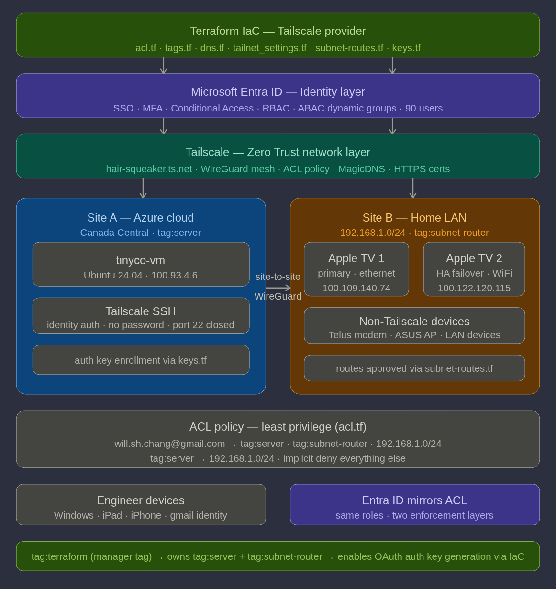

# WSHC Zero Trust IaC Lab

**Author:** Will Chang, Customer Success Engineer  
**GitHub:** https://github.com/willshchang/WSHC-ZeroTrust-IaC-Lab  
**Tailnet:** hair-squeaker.ts.net

---

## Overview

A personal Zero Trust infrastructure lab demonstrating enterprise-grade 
identity and network security — built entirely with Infrastructure as Code.

The lab is structured in two layers that work together as a complete 
Zero Trust architecture:

- **Entra IAM** — Microsoft Entra ID tenant managing 90 users, dynamic 
  ABAC groups, RBAC, Conditional Access, and SSO for multiple SaaS 
  applications. Fully deployed via Terraform IaC.

- **Tailscale** — Zero Trust network layer managing site-to-site subnet 
  routing, identity-driven SSH, ACL policy, and device enrollment. 
  Fully configured via Terraform IaC.



---

## Architecture

### Two-Layer Zero Trust Model

| Layer | Tool | What it enforces |
|---|---|---|
| **Identity** | Microsoft Entra ID | Who can authenticate — SSO, MFA, RBAC, Conditional Access |
| **Network** | Tailscale | What authenticated devices can reach — ACL policy, least privilege |

Neither layer trusts the other implicitly. A user must pass both 
identity verification (Entra ID → Tailscale SSO) AND network access 
control (Tailscale ACL policy) before reaching any resource.

### Lab Topology
Terraform IaC
↓ manages both layers
Microsoft Entra ID (identity)  +  Tailscale (network)
↓                                   ↓
Site A — Azure VM                Site B — Home LAN
tinyco-vm (tag:server)           Apple TV x2 (tag:subnet-router)
Tailscale SSH                    HA subnet routing 192.168.1.0/24
100.93.4.6                       primary: 100.109.140.74
failover: 100.122.120.115

---

## Repository Structure
WSHC-ZeroTrust-IaC-Lab/
│
├── README.md                        ← you are here
│
├── Entra IAM/                       ← identity infrastructure
│   ├── Entra_IAM_README.md          ← full Entra IAM documentation
│   ├── terraform/                   ← Entra ID IaC (users, groups, RBAC, SSO)
│   ├── scripts/                     ← ETL pipeline, gallery lookup
│   └── docs/                        ← admin and user documentation
│
└── Tailscale/                       ← network infrastructure
├── terraform/                   ← Tailscale IaC (ACL, tags, DNS, routes, keys)
│   ├── providers.tf
│   ├── variables.tf
│   ├── acl.tf
│   ├── tags.tf
│   ├── dns.tf
│   ├── tailnet_settings.tf
│   ├── subnet-routes.tf
│   └── keys.tf
└── docs/                        ← network and IaC documentation
├── iac/                     ← Terraform IaC docs (one per tf file)
├── 01-Subnet_Router_Setup_and_Troubleshooting.md
├── 02-ACL_Tags_and_Access_Control.md
├── 03-Network_Architecture.md
├── 04-Patterns_From_My_Field.md
└── 05-SSH_Setup_and_Troubleshooting.md

---

## Tailscale — Quick Start

### Prerequisites (manual — IaC boundary)

```bash
# 1. Create Tailscale account at tailscale.com
# 2. Install Tailscale on each device:

# Linux VM
curl -fsSL https://tailscale.com/install.sh | sh
sudo tailscale up --authkey=$(terraform output -raw vm_auth_key) \
  --ssh --accept-routes --advertise-exit-node

# Windows / macOS / iOS / Android
# Download from tailscale.com/download or App Store
# Sign in with your identity provider

# Apple TV (subnet router)
# App Store → Tailscale → Settings → Enable Subnet Router

# Linux client — accept subnet routes
sudo tailscale set --accept-routes
```

### Deploy Tailscale IaC

```bash
cd Tailscale/terraform

# 1. Create OAuth client at tailscale.com/admin/settings/oauth
#    Required scopes: Devices (Core+Tags+Routes), Policy File,
#    DNS, Auth Keys, Networking Settings — all Write
#    Add tags: tag:server, tag:subnet-router, tag:terraform

# 2. Copy and fill in variables
cp terraform.tfvars.example terraform.tfvars
# Edit terraform.tfvars with your OAuth credentials and device names

# 3. Deploy
terraform init
terraform plan
terraform apply

# 4. Retrieve VM auth key for enrollment
terraform output -raw vm_auth_key
```

### What Terraform manages

| File | What it configures |
|---|---|
| `providers.tf` | Tailscale provider, OAuth authentication |
| `variables.tf` | All variables — zero hardcoded values |
| `acl.tf` | ACL grants, SSH rules, tag ownership |
| `tags.tf` | Device tag assignments |
| `dns.tf` | MagicDNS |
| `tailnet_settings.tf` | HTTPS certificates, device auto-updates |
| `subnet-routes.tf` | Subnet route approvals (HA pair) |
| `keys.tf` | Auth key generation for VM enrollment |

### IaC Boundary

Terraform manages Tailnet configuration. Device installation and 
enrollment are manual prerequisites — same honest boundary as any 
production IaC deployment.

| Step | Method |
|---|---|
| Install Tailscale on devices | Manual — CLI or App Store |
| Enroll devices into Tailnet | Manual — `tailscale up` or app login |
| Enable subnet router on Apple TV | Manual — Tailscale app settings |
| Enable Tailscale SSH on VM | Manual — `sudo tailscale set --ssh` |
| **All Tailnet configuration** | **Terraform** ✅ |

---

## Entra IAM — Quick Start

The Entra IAM layer manages identity for 90 users across 9 teams 
with full RBAC, dynamic ABAC groups, Conditional Access, and SSO 
for Tailscale, Mattermost, Tableau, and Elastic.

See the full documentation:  
[Entra IAM/Entra_IAM_README.md](./Entra%20IAM/Entra_IAM_README.md)

---

## Key Design Decisions

### Zero hardcode — fully portable
No device IDs, user names, or credentials exist in any `.tf` file. 
All values are injected via `terraform.tfvars` — gitignored, never 
committed. Swap the variables file and the same code deploys to 
any Tailnet.

### Data sources over hardcoded IDs
Device IDs are looked up dynamically at plan time using 
`data "tailscale_device"` — IDs never hardcoded. If a device is 
re-enrolled, the data source fetches the new ID automatically.

### Import blocks for existing state
Tailscale creates default ACL and DNS preferences on every new 
Tailnet. Import blocks bring these into Terraform state before 
managing them — preventing "resource already exists" errors and 
making the codebase safe to run against any Tailnet.

### tag:terraform — OAuth manager tag
Tailscale OAuth clients cannot generate auth keys for tags they 
don't own. `tag:terraform` is a manager tag assigned to the OAuth 
client — it owns `tag:server` and `tag:subnet-router`, giving 
Terraform permission to generate tagged auth keys via IaC.

### Secret sprawl prevention
OAuth credentials live only in `terraform.tfvars` — gitignored 
and never committed. In production, secrets would be injected via 
CI/CD environment variables or a secrets manager (Azure Key Vault, 
HashiCorp Vault). The code itself contains zero secrets.

---

## Security Notes

- No credentials, PII, or sensitive data in this repository
- `terraform.tfvars` is gitignored — all secrets stay local
- SSH port 22 closed to public internet — Tailscale SSH only
- ACL policy enforces least privilege — implicit deny by default
- All app access enforced via Entra ID group assignments and 
  Conditional Access policies

---

## Tech Stack

| Layer | Technology |
|---|---|
| **Identity** | Microsoft Entra ID (E5) |
| **Network** | Tailscale (personal plan, hair-squeaker.ts.net) |
| **IaC** | Terraform (azuread + azurerm + tailscale providers) |
| **VM** | Azure (Ubuntu 24.04, Standard B2s, Canada Central) |
| **Scripting** | Bash (ETL pipeline, gallery lookup) |
| **Version Control** | GitHub |

---

## Documentation Guide

| Goal | Document |
|---|---|
| Understand the full network architecture | [03-Network_Architecture.md](./Tailscale/docs/03-Network_Architecture.md) |
| Tailscale IaC setup and troubleshooting | [Tailscale/docs/iac/](./Tailscale/docs/iac/) |
| Subnet router setup and troubleshooting | [01-Subnet_Router_Setup_and_Troubleshooting.md](./Tailscale/docs/01-Subnet_Router_Setup_and_Troubleshooting.md) |
| ACL policy and tags | [02-ACL_Tags_and_Access_Control.md](./Tailscale/docs/02-ACL_Tags_and_Access_Control.md) |
| Tailscale SSH | [05-SSH_Setup_and_Troubleshooting.md](./Tailscale/docs/05-SSH_Setup_and_Troubleshooting.md) |
| VPN patterns and real-world use cases | [04-Patterns_From_My_Field.md](./Tailscale/docs/04-Patterns_From_My_Field.md) |
| Entra IAM full documentation | [Entra IAM/Entra_IAM_README.md](./Entra%20IAM/Entra_IAM_README.md) |